# cmake-learn


参考链接

[cmake保姆级教程上]: https://subingwen.cn/cmake/CMake-primer/


## cmake概述


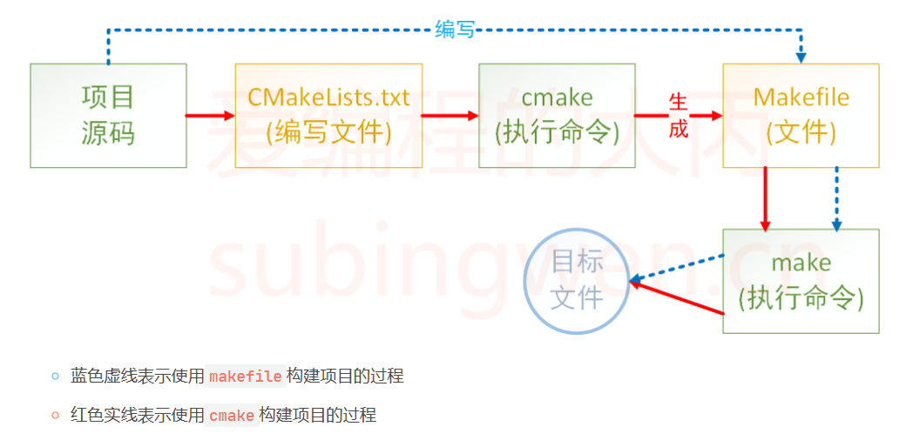


**引入cmake之前：**

需要编写项目源码和makefile，然后执行make命令

问题：**makefile 通常依赖于当前的编译平台**，而且编写 makefile 的工作量比较大，解决依赖关系时也容易出错。


**cmake引入后:**

编写项目源码和CMakeLists.txt，然后执行make命令


**cmake作用及优点：**

 

CMake 允许开发者指定整个工程的编译流程，在根据编译平台，自动生成本地化的Makefile和工程文件，最后用户只需make编译即可，所以可以把CMake看成一款自动生成 Makefile的工具,


优点： 跨平台

​			简化编译构建过程和编译过程


## cmake使用

### 1.注释

注释行和注释块


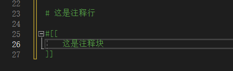


### 2.build的由来及简单使用

源文件准备:

main.h:

```c++
#include<iostream>
using namespace std;

int add(int a, int b);
```

main.cpp

```c++
#include"main.h"
int add(int a,int b)
{
    return a+b;
}
int main()
{
    cout<<add(1,5)<<endl;
    return 0;
}
```


**build前的cmake，make工程:**

CMakeLists.txt 文件的三个基本命令：

```c++
# 指定使用的 cmake 的最低版本
cmake_minimum_required (VERSION 3.8)
    
# 定义工程名称
project(hello)

# 定义工程会生成一个可执行程序
# add_executable(可执行程序名 源文件名称)
add_executable(hello main.h main.cpp)
```


此时文件目录:

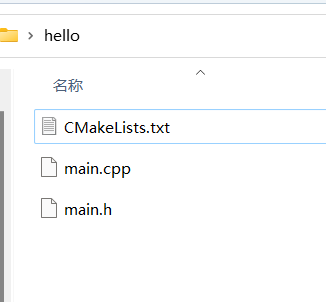


（1）对CMakeLists进行cmake生成makefile

（2）对makefile进行make生成可执行程序


**（1）对CMakeLists进行cmake生成makefile**

```c++
cmake CMakeLists.txt文件所在路径
```

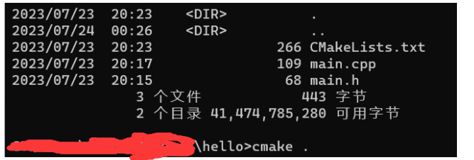

但是变成了这样子

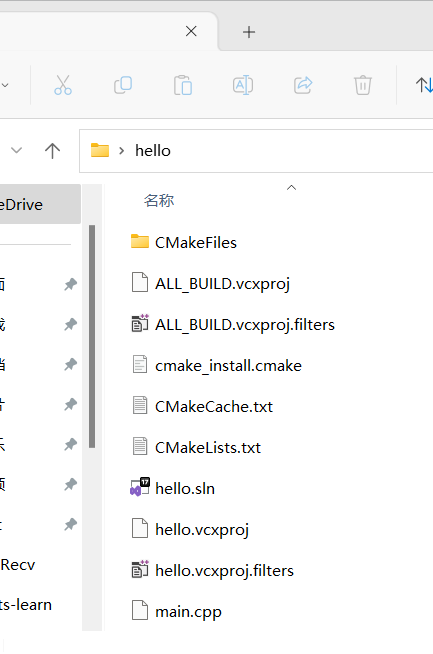

.sln可直接用visual studio打开

#### tip:windows编译cmake，生成.sln，不生产makefile

```
cmake .. -G "Unix Makefiles"
```

[最后解决链接](https://zhuanlan.zhihu.com/p/548235468)


大致方法如下:

在MakeLists.txt中添加

注意这里: 双反斜杠\也是不行的

```cma
set (CMAKE_C_COMPILER "D:/environment/c++_envir/mingw64/bin/gcc.exe")

set (CMAKE_CXX_COMPILER "D:/environment/c++_envir/mingw64/bin/g++.exe")
```

命令行用:

```powershell
CMAKE . -G "MinGW Makefiles"
```


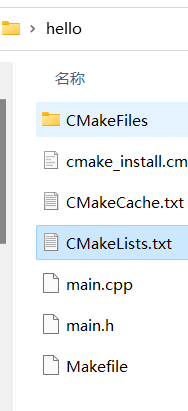

**（2）对makefile进行make生成可执行程序**


[缺少make工具](https://blog.csdn.net/weixin_43782998/article/details/117742184)

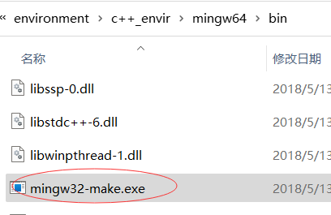

找到它，然后添加环境变量，拷贝或重命名mingw32-make.exe为make.exe

然后就好了

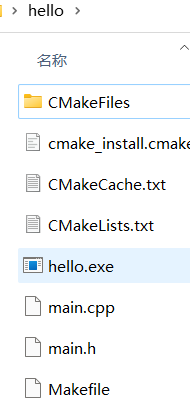

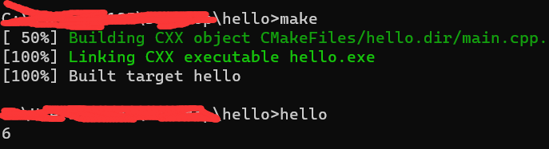


**build引入**

可以看见此时目录下源码和可执行文件等混合，比较乱。

所以我们就创建一个build目录用于存放源码之外的所有东西makefile,可执行程序等

### 3. 变量

```cmake
# SET 指令的语法是：
# [] 中的参数为可选项, 如不需要可以不写
SET(VAR [VALUE] [CACHE TYPE DOCSTRING [FORCE]])

# 方式1: 各个源文件之间使用空格间隔
# set(SRC_LIST  main.c  main.h)

# 方式2: 各个源文件之间使用分号 ; 间隔
set(SRC_LIST main.c;main.hc)
add_executable(app  ${SRC_LIST})

```

#### tip 指定使用c++版本

C++标准对应有一宏叫做DCMAKE_CXX_STANDARD。在CMake中想要指定C++标准有两种方式

```cmake
# 1.在CMakeLists.txt中指出
set(CMAKE_CXX_STANDARD 11)
set(CMAKE_CXX_STANDARD 14)
set(CMAKE_CXX_STANDARD 17)


# 2.执行cmake命令时，指出这个宏的值
cmake CMakeLists.txt文件路径 -DCMAKE_CXX_STANDARD=11
cmake CMakeLists.txt文件路径 -DCMAKE_CXX_STANDARD=14
cmake CMakeLists.txt文件路径 -DCMAKE_CXX_STANDARD=17

```

[c++版本与对应gcc版本支持关系](https://blog.csdn.net/u010977122/article/details/100708274)

**gcc8.1完全支持c++17**

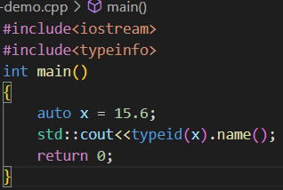


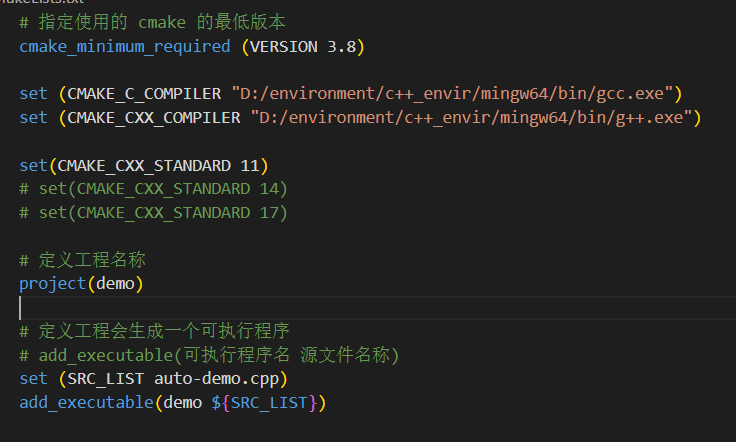

然后运行

```cmake
cmake .. -G "MinGW Makefiles"
```


也可以用-DCMAKE_CXX_STANDARD=11显示指出

```cmkae
cmake .. -G "MinGW Makefiles" -DCMAKE_CXX_STANDARD=11
```

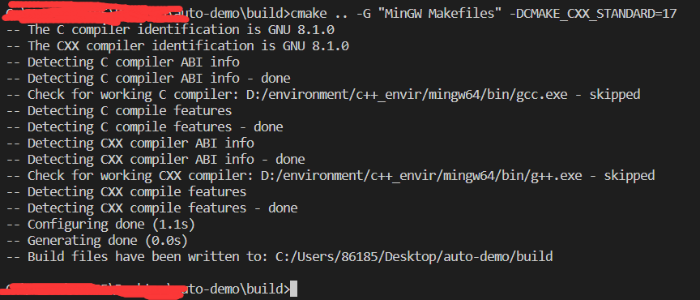

接着make就得到可执行程序

